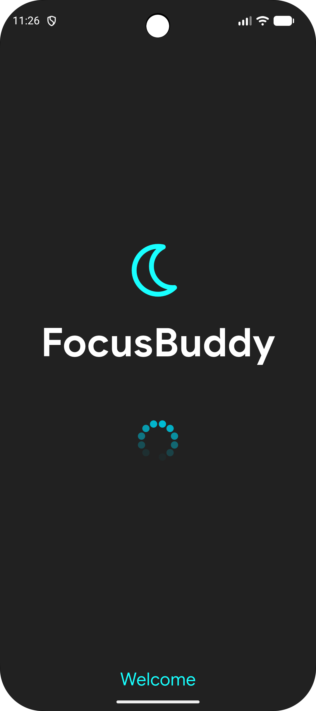
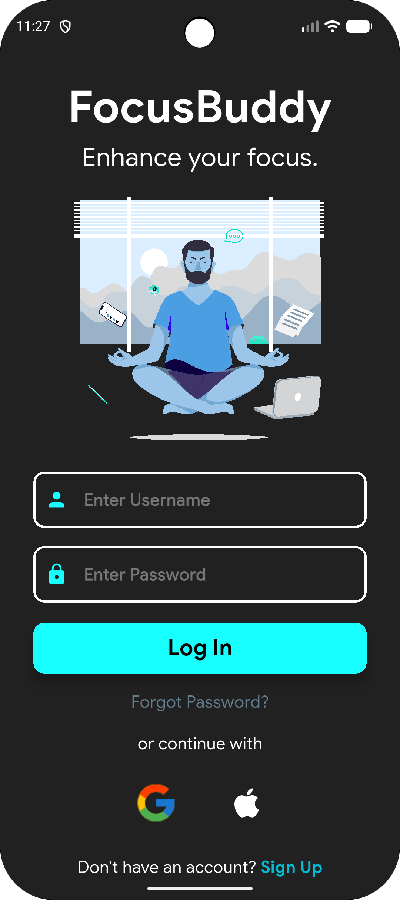
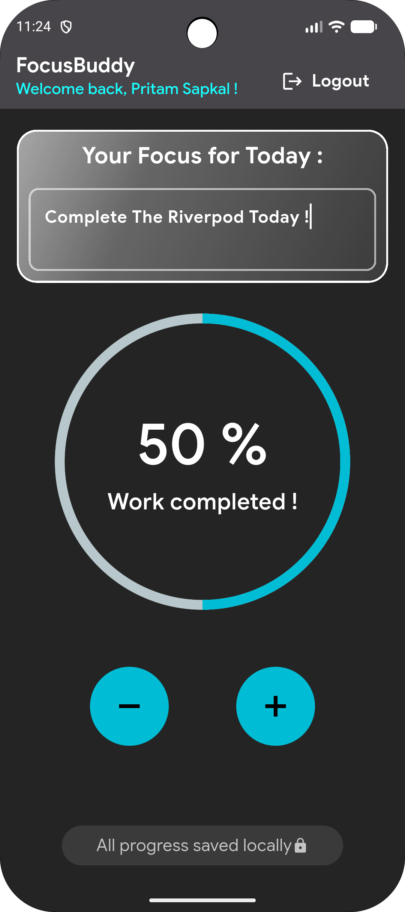

<h1>FocusBuddy 🌙🎯</h1>

  
  

<b>Tagline:</b> <i>A minimalist dark-themed focus tracker built with Provider and Shared Preferences.</i>

FocusBuddy is a clean and intuitive productivity app built using Flutter to practice state management and local data saving. Designed with a modern dark theme, it allows users to set a daily focus goal and easily track their completion progress through an interactive interface.

<h2>📌 About the Application</h2>

FocusBuddy is a practice project built to learn and implement core Flutter concepts. The primary goal of this application was to master clean state management using the Observer pattern (via Provider) and figure out how to handle local data persistence (via Shared Preferences). It goes beyond static UI layouts to implement active state updates, data saving, and a fluid circular progress bar.

<h2>🖼️ Application Showcase</h2>

  
  
  

<h2>✨ Core Features</h2>

<ul>
  <li>⚡ <b>Reactive State Management:</b> Powered by <b>Provider</b> to handle state updates efficiently, ensuring that progress modifications instantly reflect across the UI screens without rebuilding the entire widget tree.</li>
  <li>🔒 <b>Persistent Authentication Lifecycle:</b> Implements basic session caching via <b>Shared Preferences</b>. The app checks for a login flag during startup, allowing authenticated users to bypass the login screen and auto-route straight to the home dashboard.</li>
  <li>📊 <b>Interactive Progress Visualization:</b> Integrates a circular percent indicator that dynamically translates task completion steps into real-time visual progress updates with centered text reflections.</li>
  <li>💾 <b>Local Data Persistence:</b> Automatically saves the user's focus goals, text inputs, and exact progress metrics to the device storage. If the app is closed or restarted, the state is restored seamlessly upon relaunch.</li>
  <li>🚪 <b>Session Invalidation (Logout):</b> Features a clear logout routine that flushes the stored authentication flag and resets the application state before safely routing the user back to the login gateway.</li>
</ul>

<h2>🧭 Application Architecture Workflow</h2>

<ol>
  <li>
    <b>Pre-Boot Environment Setup</b>
    <ul>
      <li>During the Splash Screen phase, the application queries local Shared Preferences storage to check for existing authentication flags and cached task configurations.</li>
    </ul>
  </li>

  <li>
    <b>Dynamic Gateway Routing</b>
    <ul>
      <li>If a persistent session flag exists, the router immediately mounts the Home Screen dashboard. If no session is found, the user is cleanly directed to the Login Screen interface.</li>
    </ul>
  </li>

  <li>
    <b>State Interaction & Increment Optimization</b>
    <ul>
      <li>The Home Dashboard exposes interactive control nodes (Add/Remove steps). Interaction triggers state dispatches inside the change notifier, computing new percentages and writing updates to disk asynchronously.</li>
    </ul>
  </li>

  <li>
    <b>Session De-authorization</b>
    <ul>
      <li>Triggering the Logout command clears state models, executes a structural wipe of local persistence blocks, and rebuilds the navigation stack to prevent unauthorized deep linking back to the dashboard.</li>
    </ul>
  </li>
</ol>

<h2>🛠️ Tech Stack & Dependencies</h2>

<ul>
  <li><b>Framework:</b> Flutter (Stable Channel)</li>
  <li><b>Language:</b> Dart</li>
  <li><b>State Core:</b> <code>provider</code></li>
  <li><b>Local Caching Layer:</b> <code>shared_preferences</code></li>
  <li><b>UI Motion & Graphics:</b> <code>circular_percent_indicator</code></li>
  <li><b>Target Platform:</b> Android (API 21+) / iOS</li>
</ul>

<h2>🚧 Current Development Status</h2>

✅ <b>v1.0.0 Completed</b> (The 2-day architectural sprint succeeded with full state synchronization, session persistence, and custom neon dark-mode UI layouts fully production-ready).

<h2>🔮 Future Architecture Enhancements</h2>

<ul>
  <li>📈 Historical focus analytics sheets to display weekly and monthly productivity trends.</li>
  <li>⏱️ Integrated Pomodoro Focus Engine with background countdown workers and local alarms.</li>
  <li>🌌 Expanded state implementation covering more granular multi-task checklists per day.</li>
</ul>

<h2>🚀 Local Setup & Installation</h2>

To clone and audit the FocusBuddy codebase locally on your machine, execute the following setup sequence inside your terminal:

<pre>
git clone https://github.com/PritamSapkal/FocusBuddy.git
cd FocusBuddy
flutter pub get
flutter run
</pre>

<h2>🤝 Contribution & Code Review</h2>

This repository showcases solid foundational patterns for reactive UI programming and session persistence using Flutter. Recommendations regarding alternative state frameworks (e.g., Riverpod transitions) or encrypted local storage structures are highly welcomed.

<h2>📄 Educational License</h2>

This application is engineered strictly for learning, architectural demonstration, and educational portfolio purposes.

⭐ If you find this engineering implementation useful, feel free to star the repository!

